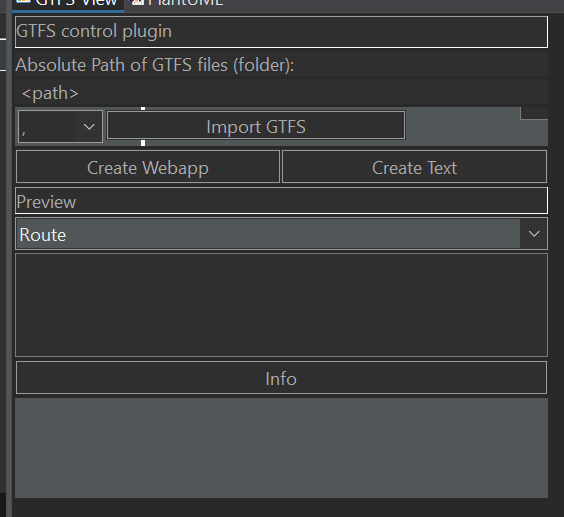
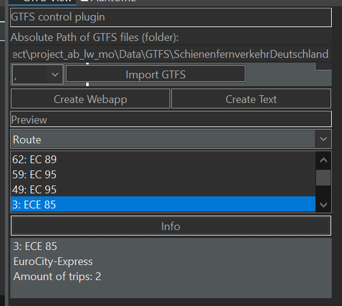

# Project Ab Lw Mo

The goal of this project is to get experience and knowledge with DSL (domain-specific language) modules.

For our group this meant realizing the GTFS system with Ecore.

### Example Dataset
In this repository there is a example data set in the /Data/GTFS folder. Unzip the GTFS "Schienenfernverkehr Deutschland" (German train traffic).
Use the absolute path (<some path>/Data/GTFS/SchienenfernfehkehrDeutschland) as input for most of the programs.

## Authors

| Name        | Email    | Parts |
|--------------|-----------|------------|
| Anna Bodnar |  annabod@stud.ntnu.no     | UI        |
| Maximilian Ogris      | maximio@stud.ntnu.no  | Model, Plugin       |
| Luuk Wubben | luuktw@stud.ntnu.no | M2T |

## GTFS
GTFS stands for General Transit Feed Specification and it is a global supported protocol for providing public transport data including stations, routes and timings.
Nearly every public transport provider supports the base version of GTFS while many also support a varying amount of additions to the basic protocol. In this project we only provide the base version of GTFS.
The dataset is a zipped folder of a relational database in form of multiple csv files. 

In the work of the project was a dataset from Germany's national train company 'Deutsche Bahn' used as example.

# Parts
The project has multiple smaller projects which are all powered by the main parts of the Ecore model.

## The model
The model is realized in `GTFSRaw.model` folder and it contains 2 different models:
First is the `GTFSRawModel` model which represents the database with its number values and IDs. This model is directly read from the file system (the GTFS csv files).
The `Collection` object within the model contains a "load" method called `readGTFSFiles` with the value separator (";" or ",") and the folder path as parameters. (This folder has to contain all GTFS files).
Then the Model2Model transformation is executed to convert the raw model to the normal model with the `importRaw` method of the `GTFSModel`, which has a higher level of parameters (Enums, bools) instead of numbers and direct relations instead of IDs.
The read and conversion functions are part of the model.
The model does not contain test code.

## The model tester
The project GTFS tester was solely created to test the read process of the model. Now it is used to trigger/run the Model to text (M2T) generator.

Execution:
-  [x] open GTFSTester project in eclipse
-  [x] Launch main with absolute Path to the folder of the GTFS as argument
-  [x] Activate the text generator and provide the file name to the console.

The file RawTester tests the reading from a csv file and conversion to a raw model.

## UI
We decided to work with a webframework as user interface.
We built our user interface using [React](https://reactjs.org/). React is one of the most-used frameworks for web development. As timetables is the most frequently used online service of public transport providers, we decided to build a simple website to display online timetable. The website can be configured display the timetable of any public transport provider (if the GTFS data is avaliable). The webpage is one single file (`index.html`) which reads all the neccesary informations from the `timetable.json` json file. This file can be generated by GTFSUI which collects all the necessary information from the model.


Execution:
-  [x] open GTFSUI project in eclipse
-  [ ] Launch main with absolute Path to the folder of the GTFS as argument (if you dont do that the program will ask you for the path in the console)
  
Launch Webpage:
-  [x] Go to the GTFSUI/webpage folder. (This folder should contain two files: `index.html` and `timetable.json`)
-  [x] Start a simple web server in this folder (eg. [http-server](https://www.npmjs.com/package/http-server))

## Model to Text
This subproject provides a file generator that converts the GTFS collection with all important information to a simple human-readable txt file. The generator works as an Acceleo Model To Text Generator project and has a class `Generate` which can be instantiated with a model, an output location, and any required additional arguments for generation (in this case the name of the file). The `Generate` class instance can then be executed by calling the `doGenerate()` method with `null` as the only parameter like so:

```
Generator gen = new Generator(model, new File('./path/to/output/directory/'), ["filename.txt"].asList());
gen.doGenerate(null);
```

The generator can be executed quickly (and without writing code) with the GTFSTester class, or using the plugin UI on any imported GTFS Collection data.

## Plugin
In the work of this project a plugin was created which allows to read a GTFS file to an eclipse instance.
In this instance a small overview is provided with a list of routes or stops and a few facts about the selected route/stop can be shown by clicking info.
This plugin also allows to generate the necessary files for the WebUI and the human-readable txt file.

### Comment: 
The eclipse window builder (WindowBuilder editor) did not work correctly (it crashed all the time!). The UI had to be written per hand (as code and not drag&drop).
Therefore it is clearly not a high-quality user interface.




### Execute: 
- [x] open the project in eclipse
- [x] run the project as eclipse application
- [x] In the new eclips instance open Window->Show View -> other  in "GTFS Sample View" open "GTFS View"
- [x] Resize window to an acceptable size (optimally see picture)
The first logical step is to load the GTFS into the eclipse module.
- [x] exchange \<path> to the absolute path 
(\<pathToRepository>\Data\GTFS\SchienenfernverkehrDeutschland\)
- [x] next to the "import GTFS" button is a selector which is used to define the splitter in the CSV ("," or ";") (it is "," for the provided dataset)
- [x] the loading might take its time (based on how larger the data set is) 
- [x] once it is done the list of routes (or stops) based on the preview settings will be filled
- [x] if you select something in the list viewer you can press on "Info" button to get more detailed information


### Execute other parts
- [x] the M2T can be directly triggered in the plugin by clicking "Create Text". The output is in the folder of the GTFS data (filename: output_Text.txt). (This might need a few seconds.) 

- [x] The JSON for the web UI can also be generated with this plugin. 
The output is in the folder of the GTFS data (filename: output_json.json). (This might need a few seconds.) 

Both parts are implemented in their projects by calling their functions from the respective project.

# Useful links
[GTFS Description](https://developers.google.com/transit/gtfs/reference#routestxt)

