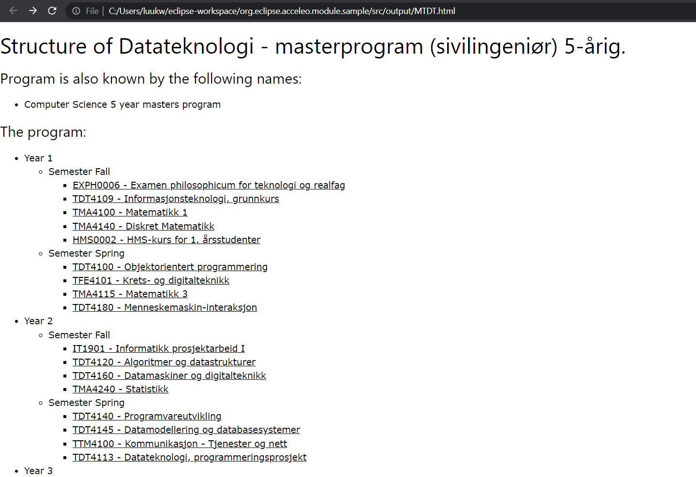
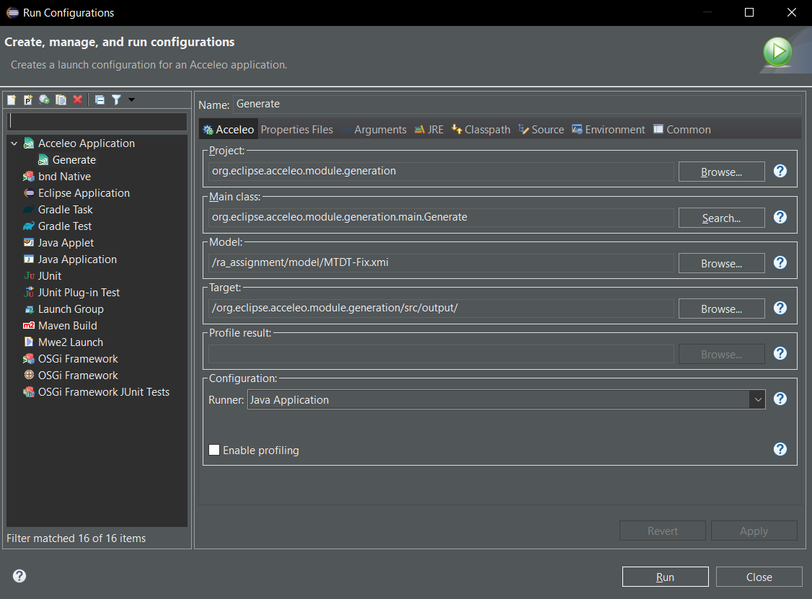
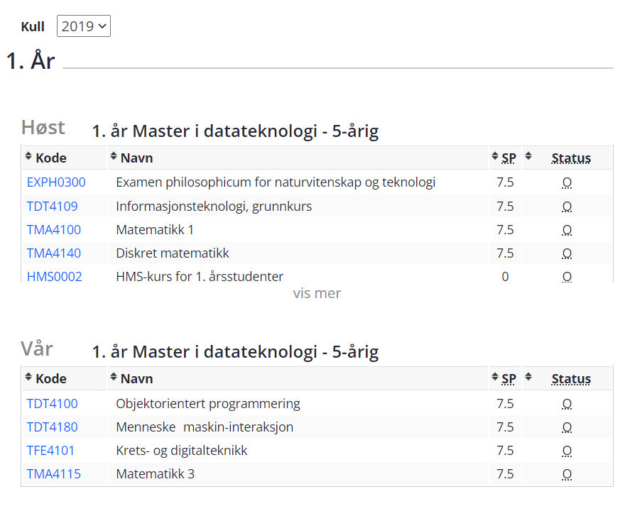
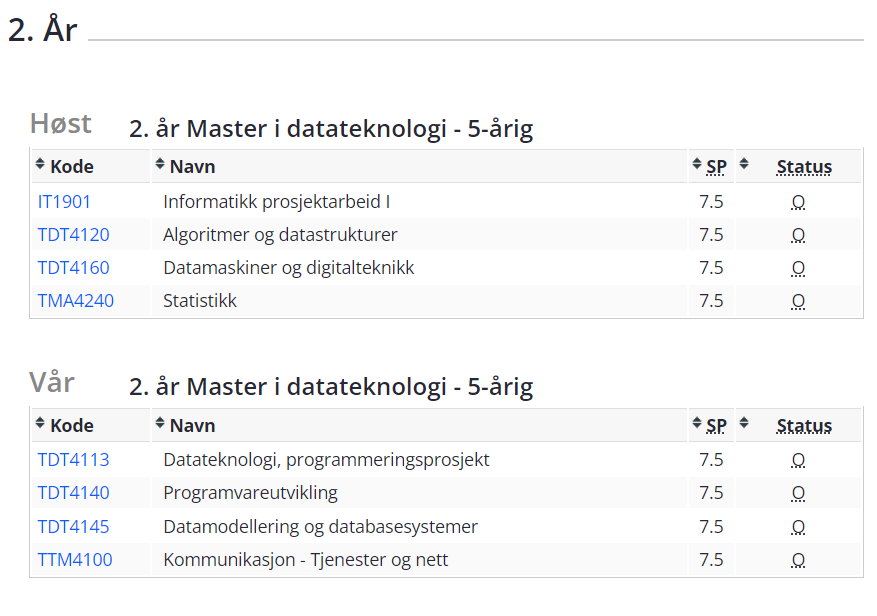
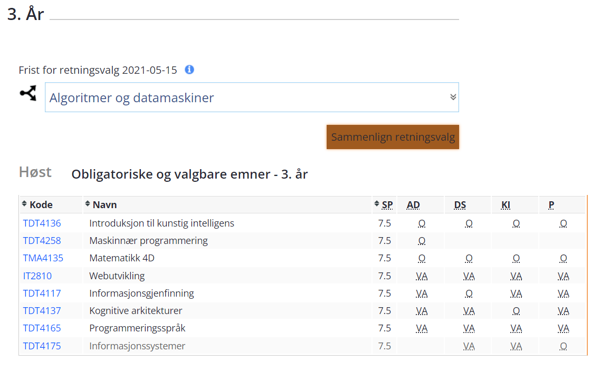

# ra_assignment_luuktw

## Collaborators

Luuk Wubben

# Assignment 2

## What was changed from the assignment 1 code
The code itself of assignment 1 was not changed, but a new `educationalProgramModelFix.ecore` file/model was created, along with an `MTDT-Fix.xmi` file/model based off it. This new implementation fixes the main issue with the original model: That the courses were contained within the semesters, causing duplicate data and course pages in the M2T generator to be generated multiple times. This has now been resolved.

## What was created
A Model-to-text generator was created, which generates a program model to a series of .html files, which can be opened through the browser. The main file will be `[Program Code].html` and from there, all other pages and info can be accessed.

An example can be seen below.

## How to run
To run the generator, first open this repository in Eclipse and make sure the required dependencies are installed. Then, run `ra_assignment` as an Eclipse application by right clicking the folder, and navigating to `Run As -> Eclipse Application`.

In the new Eclipse window that opens, open the `org.eclipse.acceleo.module.generation` project if it is not opened, and navigate to `org.eclipse.acceleo.module.generation -> src -> org.eclipse.acceleo.module.generation.main` and right click the `generate.mtl` file.

Then navigate to Run As and select the Launch Acceleo Application option and set the run configurations as in the screenshot below.

This will generate all the necessary files in `src -> output` of the same project. Open the `[Program Code].html` file in your favorite browser and it should all be there.

## Troubleshooting

If you run into any issues with running or verifying the code, please contact me through email: [luuktw@stud.ntnu.no](mailto:luuktw@stud.ntnu.no).

# Assignment 1

## Repo structure

The repo has this README, some images to be displayed in this README, and the ra_assignment directory.
This directory contains the submission for assignment 1 with all relevant code and Ecore models

## What was modelled

The website that was modelled was the [5 year master program in computer science](https://www.ntnu.no/studier/mtdt/studieretninger-og-hovedprofiler#year=2019&programmeCode=MTDT&dir=) of NTNU.

Not the entire program was recreated in a model instance, as after the Fall semester of the 3rd year, no new modelling cases presented themselves.
Therefore, the instance model is up to and including the Fall semester of the third year, so that the model covers both regular semesters and semesters of specialisations and variant courses.

The screenshots below show the overview that was used to model the semester/course outline.
The 2019 version of the program was used, as this contained the most up-to-date and complete version of the 5 year program.
However, for most individual courses, the 2021/2022 or 2022/2023 instances were used to determine staff and examination methods.

## Where to find minimum requirements of assignment

- The classes can be found practically everywhere, so those shouldn't be hard to find. Examples are the Semester class and Person class.
- The datatypes were used for assessmentTypes, which is an enum, to determine the type of Assessment used by a course (e.g. Written Exam, Project, etc.).
- Attributes are found in all classes, e.g. firstName, lastName, and email attributes in the Person class.
- References are found in, for example, the Course class, which contains an Assessment reference (containment), or the staff reference in Course (not containment).
- Opposites can be found in the Course.staff <-> Person.assignedCourses relation.
- Constraints are found in many attributes, for example, the unique constraint on Person.email, and the minimum and maximum 1 entry on the Course.code attribute.
- OCL constraints can be found in the Course class, which handle constraints for the Assessment weights (total doesn't exceed 1 and individual ones are all between 0 and 1).
- Derived features can be found in the Semester class, with the credits field (a sum of all credits of the courses in said semester).

NOTE: Due to floating point errors with the Double and Float values, I could not simply verify that a value == 1.0 or a value <= 1.0. This is why the OCL constraints have weird looking boolean checks.

## Troubleshooting

If you run into any issues with running or verifying the code, please contact me through email: [luuktw@stud.ntnu.no](mailto:luuktw@stud.ntnu.no)
